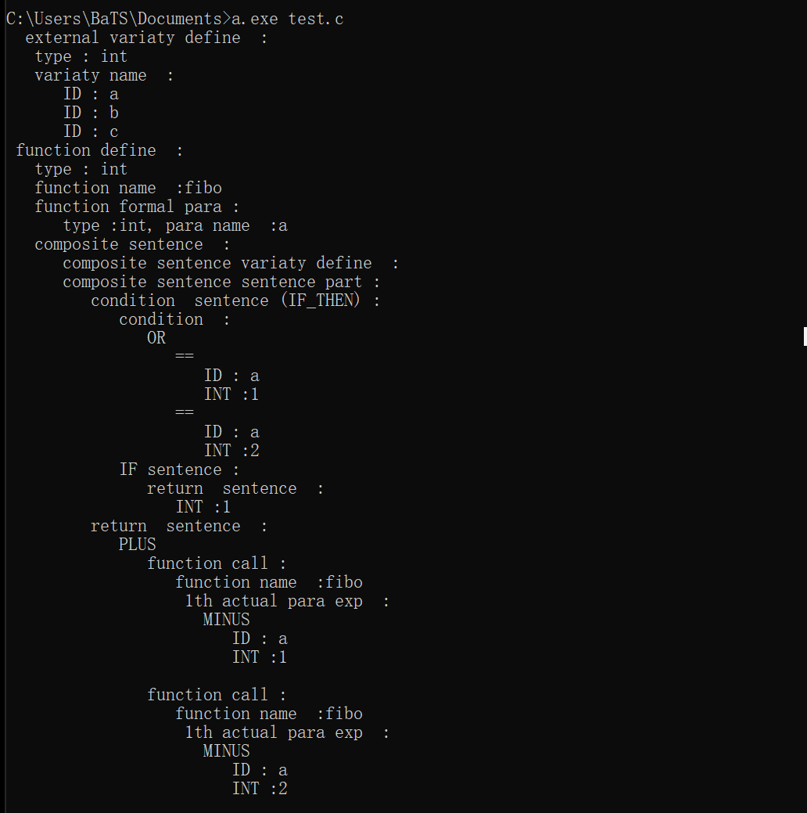
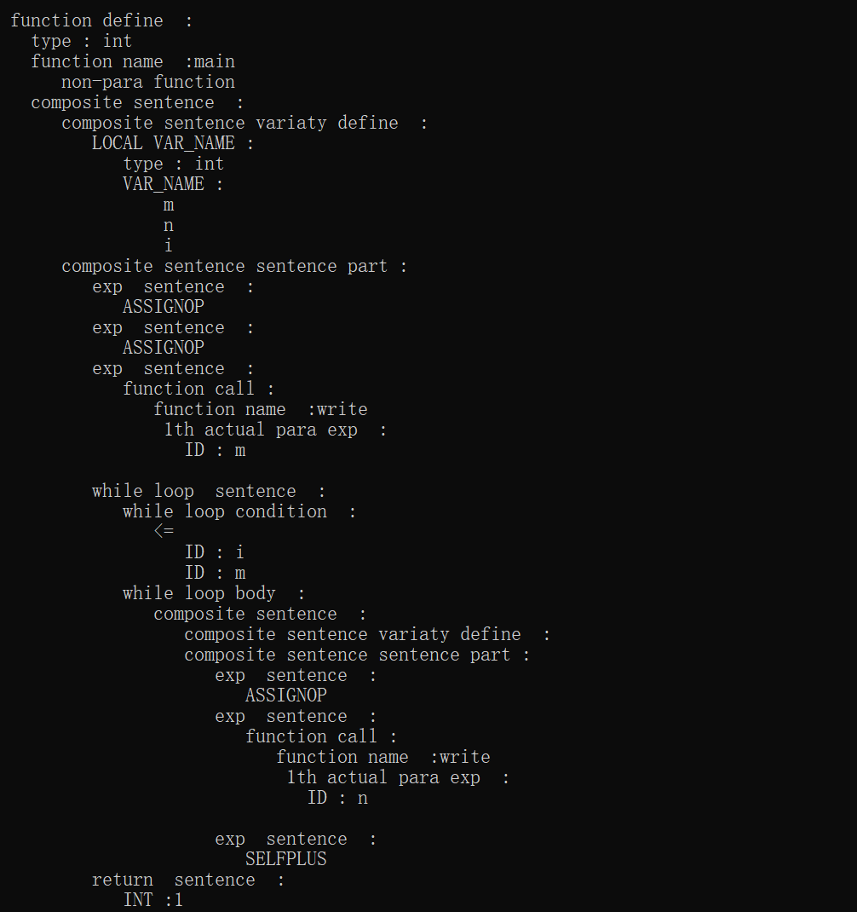
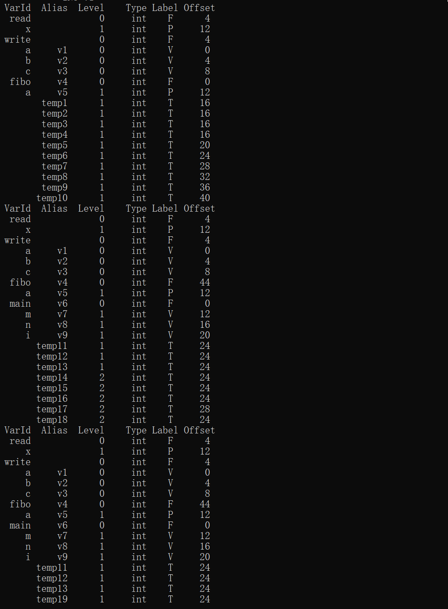
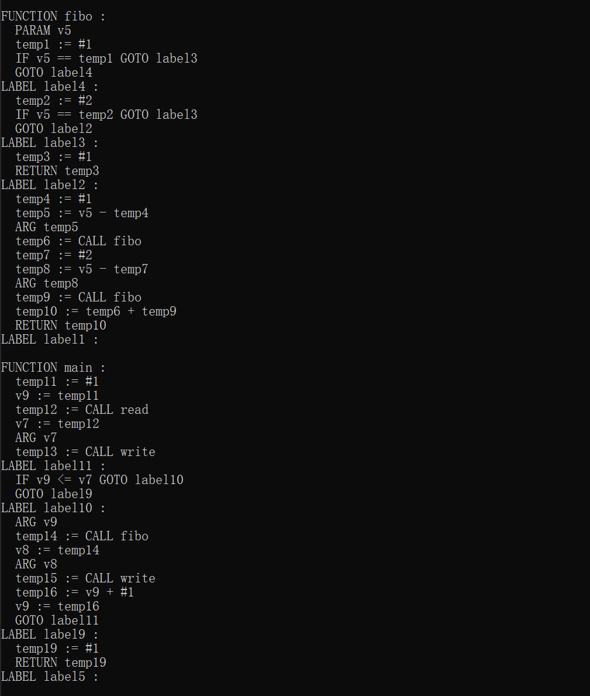

# A C-like Compiler

## Prerequisite
Flex, Bison, basic C compiler(e.g: GCC)

## Steps
1. Run action.bat (which runs flex, bison and gcc in order) to get a.exe our target compiler
2. Create a simple C-code file as input code. At present, assignment, self-plus/minus, 1-d array, conditional statement, procedure control (including "while", "for", "break" and "continue"), function definition and calling are all supported.
3. Run ` a.exe [filename] `

## Sample Result
The test.c code is as below.
```
int a,b,c;
int fibo(int a) 
{
  if (a==1|| a==2) return 1;
  return fibo(a-1) + fibo(a-2);
}
int main() 
{
  int m,n,i;
  i = 1;
  m = read();  
  write(m);
  while(i<=m)
  {
    n = fibo(i);
    write(n);
    i++;
  }
  return 1;
}
```

Then in a terminal run `a.exe test.c`  to compile text.c,
and we get the output:




and the target code: object.s

